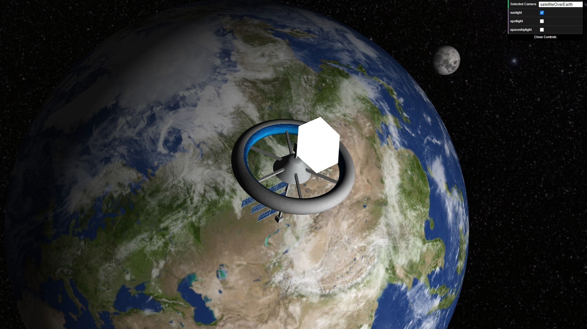
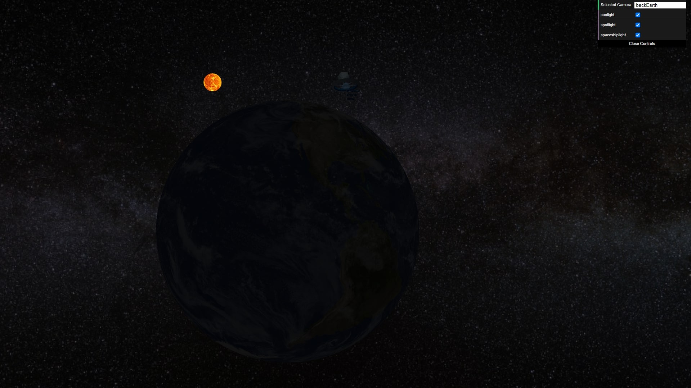
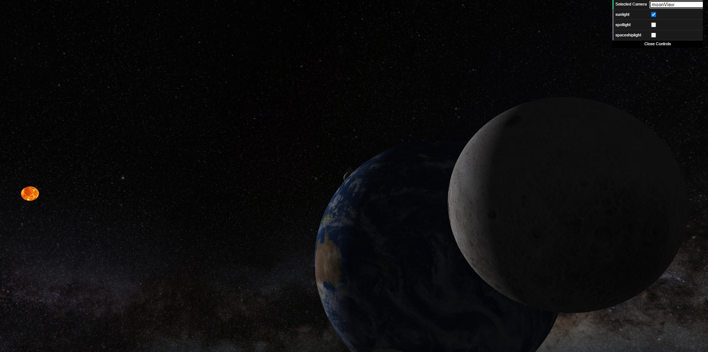
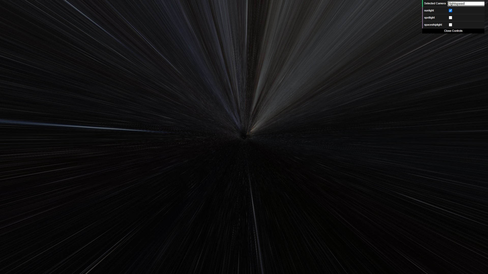
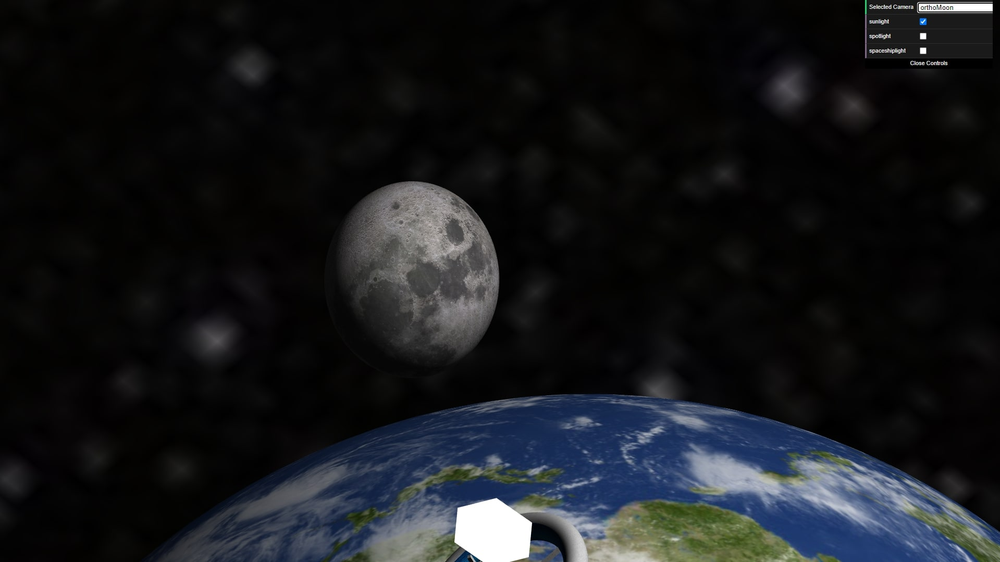
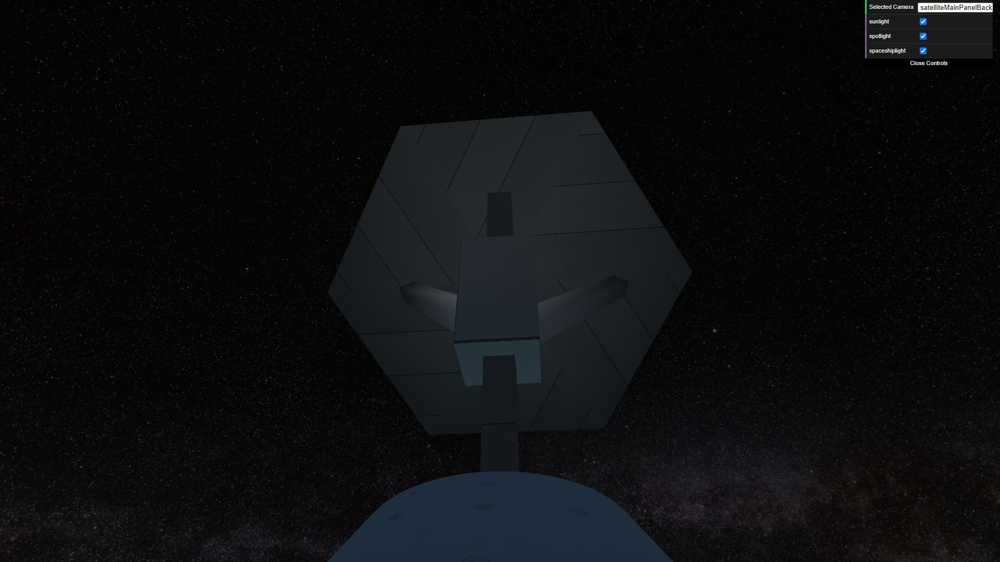
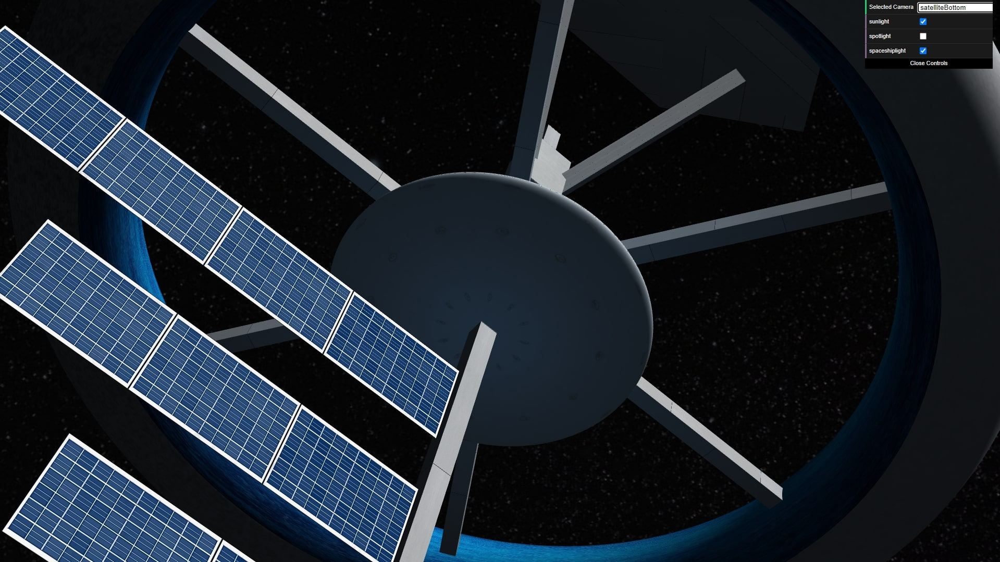

# SGI 2022/2023 - TP1

## Group T04G02

| Name                            | Number    | E-Mail                   |
| ------------------------------- | --------- | ------------------------ |
| Diogo Luís Henriques Costa      | 201906731 | up201906731@edu.fe.up.pt |
| Pedro Gonçalo de Castro Correia | 201905348 | up201905348@edu.fe.up.pt |

---

## Project information

-   Our implementation is compliant with the specification of the assignment, and so should be able to correctly parse and render XML files that are compliant with this specification. 
-   Our XML scene file is compliant with the specification of the assignment, without resorting to custom nodes or parameters that wouldn't be available to other parsers.
-   Our implementation is tolerant to errors in the XML scene file and unexpected nodes or parameters that aren't specified, logging a warning or error message but trying to still parse and render the rest of the scene.
-   We tried to make our implementation efficient, for example by avoiding reapplying an appearance when both the texture and the material of a component is "inherit", so that the same appearance can be reused by multiple children that have the "inherit" value in those components.
-   Our parser detects cycles on the scene graph and allows the XML to have components in no particular order.

-   Scene - Space Habitat Satellite
    -   This scene depicts a habitat space satellite orbiting the Earth. The moon and the sun are also visibile, as well as background stars.
    -   The XML file can be found in tp1/scenes/space.xml

---

## Issues/Problems

-   Since the XML format specified doesn't allow setting the position relative to the camera, the cubemap is static and won't move when the camera moves. However, this is a limitation from the assignment.
-   There are no unimplemented features or bugs that we are aware of.

---

## Screenshots

