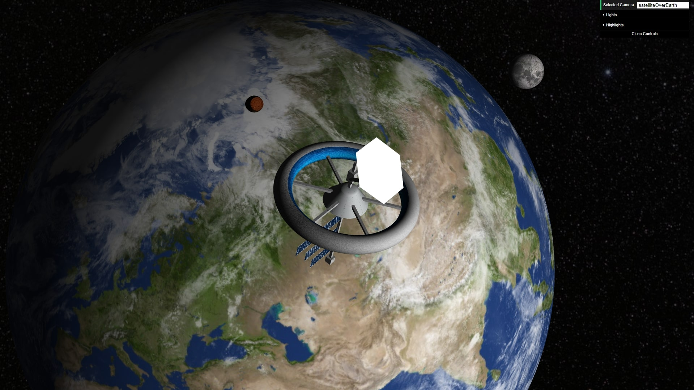
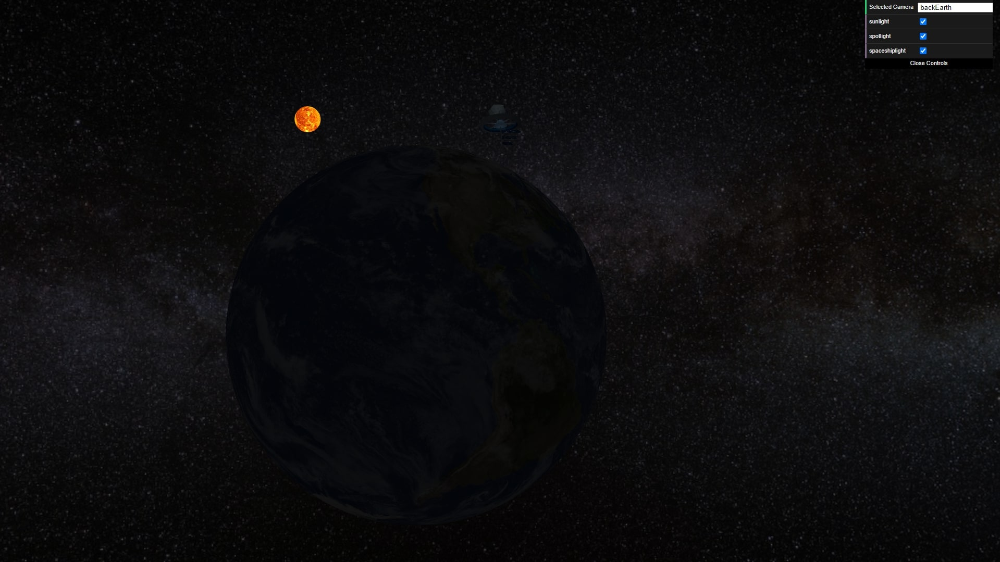
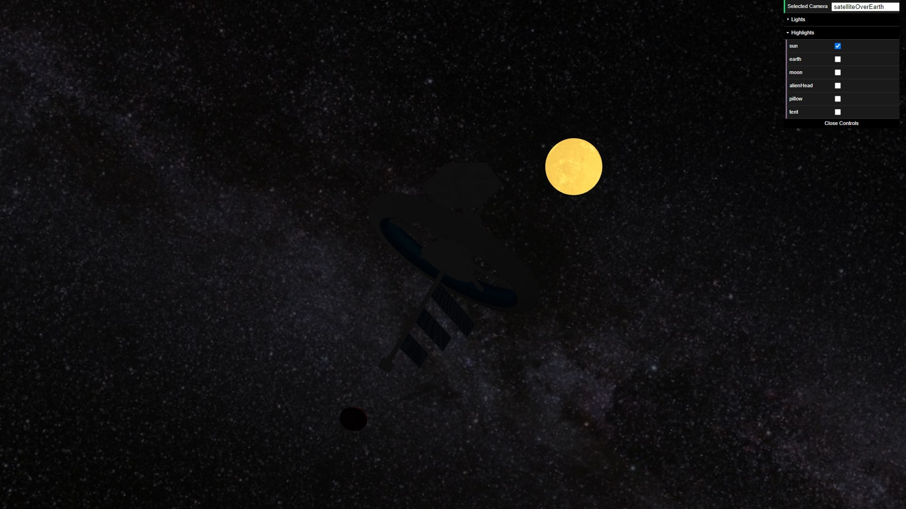
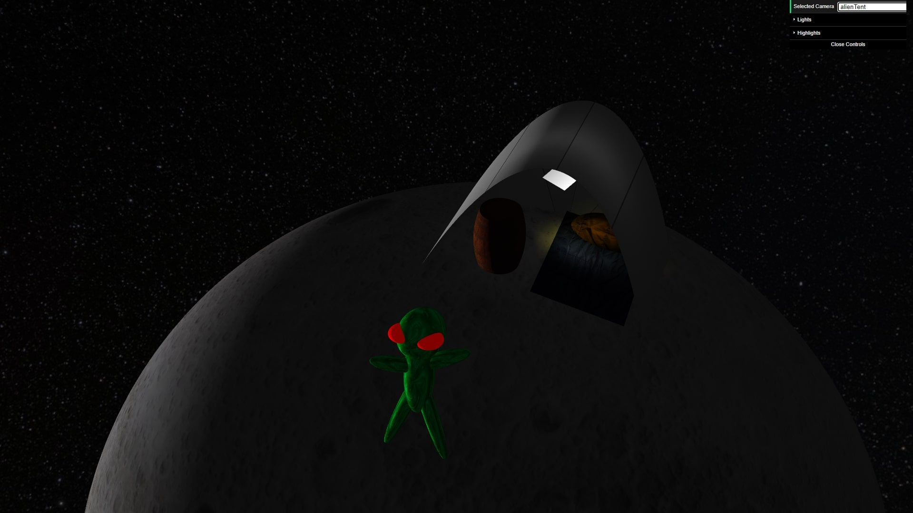
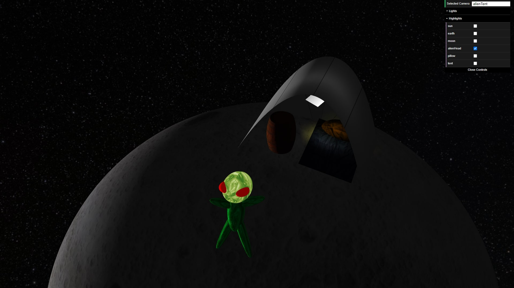
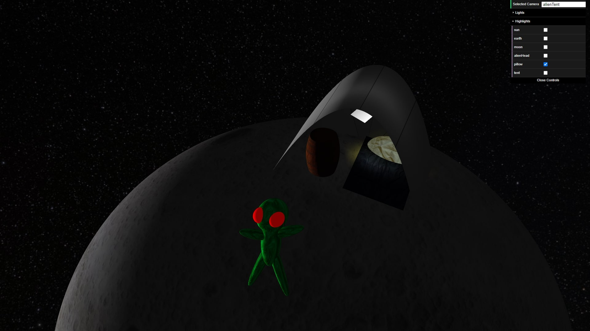
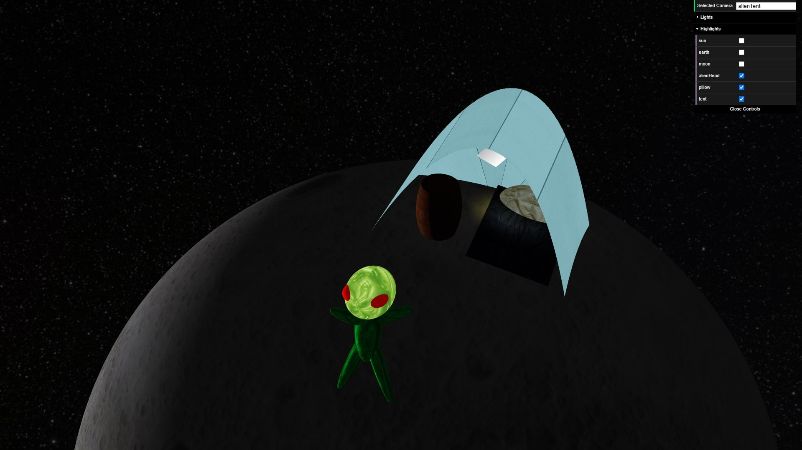

# SGI 2022/2023 - TP2

## Group T04G02

| Name                            | Number    | E-Mail                   |
| ------------------------------- | --------- | ------------------------ |
| Diogo Luís Henriques Costa      | 201906731 | up201906731@edu.fe.up.pt |
| Pedro Gonçalo de Castro Correia | 201905348 | up201905348@edu.fe.up.pt |

----
## Project information

-   Our implementation is compliant with the specification of the assignment, and so should be able to correctly parse and render XML files that are compliant with this specification. 
-   Our XML scene file is compliant with the specification of the assignment, without resorting to custom nodes or parameters that wouldn't be available to other parsers.
-   Our implementation is tolerant to errors in the XML scene file and unexpected nodes or parameters that aren't specified, logging a warning or error message but trying to still parse and render the rest of the scene.
-   We have fixed the texture coordinates of *MyCylinder*, *MyTorus* and *MyTriangle* after the feedback received in TP1.
-   We have made an effort to avoid unnecessary changes of the shader by implementing a function that checks if the shader to set is the same that is already set and only changes the shader otherwise.
-   Due to optimizations made in TP1 on setting appearances, we have to set the appearance again every time we change the shader in order to avoid issues. However, this is compensated by the fact that the TP1 optimizations reduce the amount of times the appearance has to change.
-   The required *NURBS* are all visible on the scene relatively close together on the hidden face of the moon, on which a spot-light is present pointing to the sleeping bag (made with a rectangle Patch).
-   Several animations are visible such as:
    - Orbit of a barrel.
    - Rotations of the Earth and the satellite.
    - Up-and-down animation of a component of the satellite.
    - Alien appearing only at the 5th second.
    - Alien waving.
    - Alien eyes increasing and shrinking in size.
    - A tentative explosion of the alien which causes the other objects to disappear for about 3 seconds, and re-appear slowly after that apart from the alien.
-   Several highlights are used: Sun, Earth, Moon, Alien head, pillow, tent.

-   Scene - Animated Space Habitat Satellite
    -   This scene depicts a habitat space satellite orbiting the Earth. The moon and the sun are also visible, as well as background stars.
    -   The scene is an improvement over the one from TP1. Now, on the hidden face of the moon, an alien sets a camp, visible using the *alienTent* or *moonView* cameras.
    -   The XML file can be found in [tp2/scenes/space.xml](./scenes/space.xml).

----
## Notes

-   We opted for not making the translation movement of the sattelite nor the moon around the earth, since it would make it harder to see the important objects of the scene with static cameras if those objects were moving. Moreover, their relative positions to the sun are important to be kept, especially because of the dark side of the moon. 
-   Since the assignment didn't specify looping animations, all animations eventually end and the objects freeze after enough time.

----
## Issues/Problems

-   The assignment asked for the "*novo bloco animations, a colocar entre o bloco primitives e o bloco components*" but in the example it was before the primitives block, so we opted to go with the given rule in text and assume the example was a typo.
-   There are no unimplemented features or bugs that we are aware of.

----

## Screenshots

