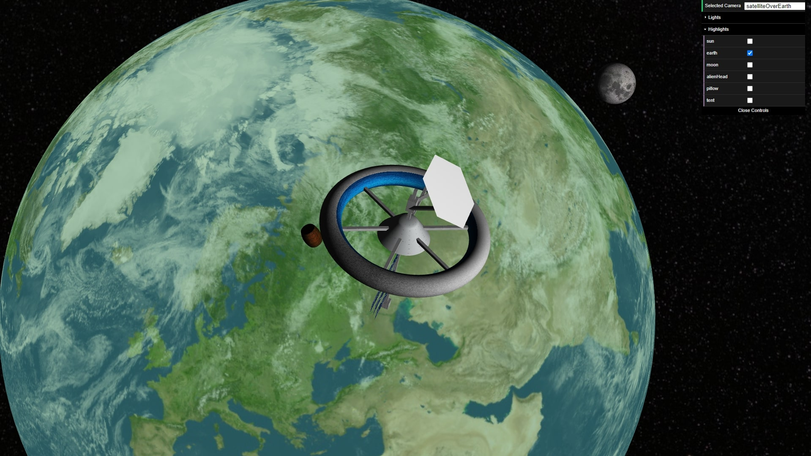

# SGI 2022/2023 - TP2

## Group T04G02

| Name                            | Number    | E-Mail                   |
| ------------------------------- | --------- | ------------------------ |
| Diogo Luís Henriques Costa      | 201906731 | up201906731@edu.fe.up.pt |
| Pedro Gonçalo de Castro Correia | 201905348 | up201905348@edu.fe.up.pt |

----
## Project information

- (items describing main strong points)
- Scene
  - (Brief description of the created scene)
  - (relative link to the scene)
----
## Issues/Problems

- (items describing unimplemented features, bugs, problems, etc.)

----

## Screenshots

