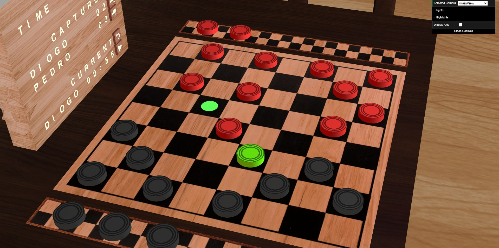
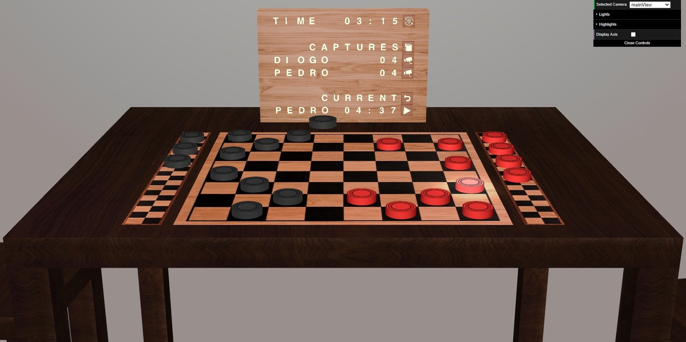
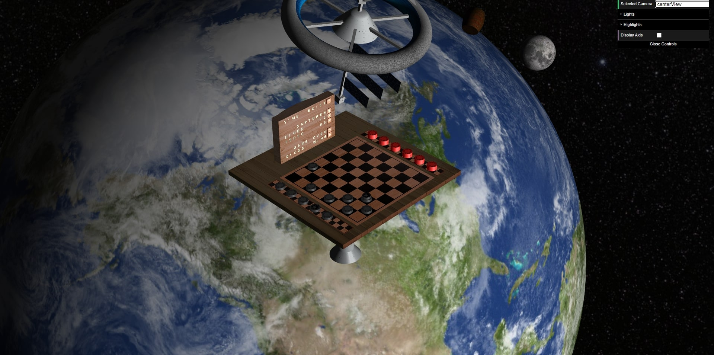

# SGI 2022/2023 - TP3

## Group T04G02

| Name                            | Number    | E-Mail                   |
| ------------------------------- | --------- | ------------------------ |
| Diogo Luís Henriques Costa      | 201906731 | up201906731@edu.fe.up.pt |
| Pedro Gonçalo de Castro Correia | 201905348 | up201905348@edu.fe.up.pt |

----
## Project information

-   We have implemented every requested feature in the assignment.
-   We think our animations are smooth, interactive and creative, making the user experience more enjoyable.
-   Selected pieces may be unselected by clicking on them again, or by clicking on another piece in order to select it.
-   On a multicapture, the piece is selected again automatically after each capture.
-   Our XML parser was extended with the `inside` parameter on `cylinder` primitives. This is "0" by default, however if it is "1" it will draw the inside of the cylinder instead of the outside. This was used in the `room.xml` scene in order to make the lamps.
-   We now also allow the `root` parameter to be missing from `scene`, in order to make component-less scenes that only display the game and/or menus.
-   We have made an effort to avoid unnecessary changes of the shader by drawing everything that requires the `transparent` shader (text, icons) at once.
-   We include two scenes, `room.xml` and `space.xml` with many geometries, materials and textures to try to give a realistic feel to the environment. We also include `empty.xml` scene to display only the game, without any distracting components.
-   Camera transictions from TP2 are also animated, on top of the new camera transitions for the TP3 (frontal game view, player 1 POV and player 2 POV).
-   The board is an entire texture in order to make it look more realistic. There are invisible tiles for the purposes of picking.
-   Crosses, hints and text are not drawn during picking, so as to not obstruct pickable elements behind them.
-   The discard boards have two height levels with 6 pieces each, in order to make the space it occupies more efficient and to make more interesting animations. After 6 places are filled, the next piece goes on top of the first one.
-   Before starting the movie, the pieces go to the initial positions with an animation, demoting queens if necessary. This animation takes into account many complex edge cases, such as when a piece is occupying the opponent's space (it will be moved to the side) and when there are pieces on top of others in the discard board (the pieces on top jump first).
-   The collision test when there is a capture is done on each update of the moving piece's position. It's position is compared with the capturable piece, in order to see if they collide. Since they have the same height, only horizontal distance is measured. Since they are cylinders (circles in their horizontal projection) with the same radius, the distance from their centers is compared against their diameter.
-   The undo animation is also animated, however, given that the piece is discarded, there is no collision detection.
-   Scene - Animated Space Habitat Satellite
    -   This scene depicts a habitat space satellite orbiting the Earth. The moon and the sun are also visible, as well as background stars. There is an alien camping in the hidden face of the moon.
    -   The scene is an improvement over the one from TP2. The satellite is no longer the center of the scene, as now a giant floating table is orbiting the earth to bring you the ultimate interplanetary checkers game experience. 
    -   The XML file can be found in [tp3/scenes/space.xml](./scenes/space.xml).
-   Scene - Bedroom
    -   This scene depicts a bedroom with a table, two chairs, a bed, a bedside table with a lamp, a wardrobe, a ball, a door and a lamp.
    -   The scene is new in the TP3.
    -   The XML file can be found in [tp3/scenes/room.xml](./scenes/room.xml).
----
## Notes

-   We opted for not making queens out of two pieces in order to give our project a more unique and creative style with the promotion animation, as well as avoid the case where no piece is in the discard board in order to make a queen.
-   Since the focus is now on the game, we removed distracting animations such as the explosion in the `space.xml` from the previous TP.
-   While a move is being animated, it is not possible to undo the move or start the game film.

----
## Issues/Problems

-   The CGF library does not expose a public method to change the "up" parameter of a CGFcamera. This made interpolation after rotating the camera look bad. The solution was to use the private _up member of the camera class, which was enough to make the interpolation work correctly. Even though accessing private members is not ideal, we believe this is a reasonable solution since this is a limitation in the CGF library.

----

## Screenshots

